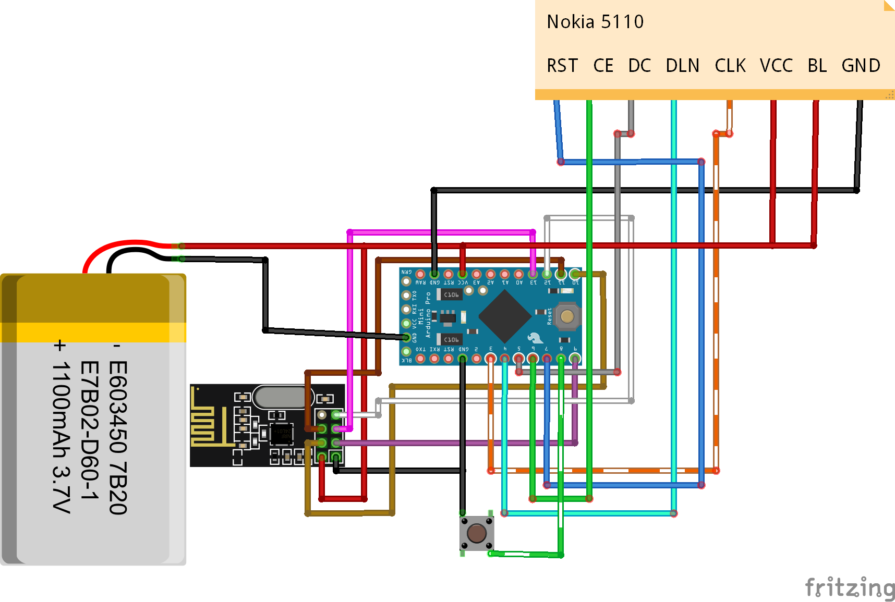

# SmartGlasses на Arduino
### Схема

### Папки
- Arduino - Скетч ардуино
- Apps - Приложения
- Libs - Библиотеки
- Image - Схема, скриншоты приложения и изображения

### Библиотеки
- PCD8544 - для работы с дисплеем Nokia 5110
- Low-Power - для энергосберижения
- GyverButton - расширенный контроль кнопкой
- GFX - для PCD8544

### Компоненты
##### Бюджет (на 23.09.2019) - 836,76 руб.
- Arduino Pro Mini: https://cutt.ly/ArduinoPhelifar
- Nokia 5110: http://ali.pub/3r75hx
### Изменения
Версии  | Дата  | Изменения 
------------- | ------------- | -------------
1.0.0  |  8 сен 2019 г.  |  Первая версия
1.0.1  |  8 дек 2019 г.  |  Убран браслет; добавлено полученние инфо с Android
